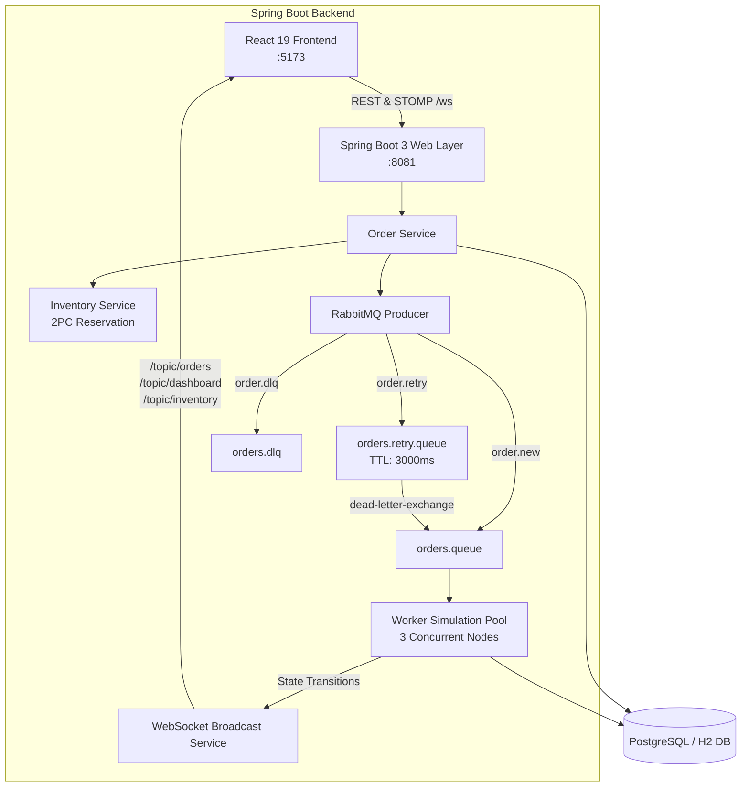

# Acentra Pulse — Concurrent Order Processing System & Live Operations Dashboard

[](https://spring.io/projects/spring-boot)
[](https://adoptium.net/)
[](https://www.rabbitmq.com/)
[](https://www.postgresql.org/)
[](https://react.dev/)
[](https://www.typescriptlang.org/)
[](https://tailwindcss.com/)

**Acentra Pulse** is an enterprise-grade, high-scale Order Processing System paired with an ultra-modern Live Operations Dashboard inspired by Stripe, Grafana, Linear, and Vercel. 

Engineered for extreme reliability, concurrency, and real-time observability, it features **RabbitMQ message queues**, **PostgreSQL persistence** (with zero-dependency H2 in-memory mode for instant demos), **STOMP WebSockets**, a **3-worker concurrent consumer pool**, **automated retry backoff**, **dead letter queue (DLQ) isolation**, and a **high-throughput stress test console**.

---

## Architecture Overview



---

## Key Features

### 1. Spring Boot 3 Backend
- **Clean Layered Architecture**:
  - `config/`: RabbitMQ Exchange & DLQ configuration, WebSocket STOMP message broker, CORS filters, async executors.
  - `controller/`: REST endpoints for Orders, Inventory, Dashboard KPIs, and Load Testing.
  - `service/`: `OrderService` (concurrency & retry orchestration), `InventoryService` (safe atomicity & stock reservations), `DashboardService` (metric aggregation), `LoadTestService` (asynchronous burst generator).
  - `worker/`: `WorkerSimulationPool` managing Worker 1 (Pod-A1), Worker 2 (Pod-B2), Worker 3 (Pod-C3) with simulated CPU/memory telemetry.
  - `rabbitmq/`: `OrderMessageProducer` & `OrderMessageConsumer` with automatic fallback when external RabbitMQ is offline.
  - `websocket/`: Live STOMP broadcasting to `/topic/orders`, `/topic/dashboard`, `/topic/inventory`, `/topic/workers`, and `/topic/queues`.
- **Zero-Dependency Instant Mode**: Runs out-of-the-box with embedded H2 DB and simulated queue routing if Docker/PostgreSQL/RabbitMQ are not installed.
- **Docker Compose Mode**: One command brings up official PostgreSQL 16 and RabbitMQ 3.13 Management console.

### 2. React 19 + TypeScript Frontend
- **Stripe / Grafana / Linear Aesthetic**: Dark/Light mode, custom glassmorphism, glowing telemetry badges, sparkline charts, and micro-animations.
- **13 Production-Ready Screens**:
  1. **Login Portal** (`/login`): Glassmorphic card, Quick-Switch role personas (Staff SRE, Enterprise Buyer, Superadmin).
  2. **Operations Dashboard** (`/`): Real-time hero banner, 8 KPI sparkline metrics, queue flow diagram, worker health, live scrolling event feed.
  3. **Order Management** (`/orders`): TanStack-style searchable data table, multi-select bulk operations, status tabs, column visibility, CSV export.
  4. **Order Timeline Drawer & Details** (`/orders/:id`): Animated vertical milestone tracker (`CREATED` → `RESERVED` → `QUEUED` → `PICKED` → `PROCESSING` → `COMPLETED` / `RETRY` / `DLQ`), payload JSON inspector.
  5. **Inventory Management** (`/inventory`): SKU stock progress meters, low-stock pulses, instant restock modal.
  6. **Stock Reservations** (`/reservations`): 2-Phase Commit hold manager with live expiring TTL countdown timers.
  7. **RabbitMQ Queues** (`/queues`): Topology visualizer (`orders.queue`, `orders.retry.queue`, `orders.dlq`), msg/sec rates, queue purge.
  8. **Worker Fleet** (`/workers`): Live worker nodes (1–4), CPU & memory progress meters, heartbeat timestamps, rolling restart action.
  9. **Analytics Center** (`/analytics`): 6 Recharts visualizations (velocity, status donut, queue depth, worker throughput, inventory depletion, error trends).
  10. **Audit Logs** (`/audit`): Security & operations ledger, actor avatars, module filters, CSV/JSON export.
  11. **Customer Procurement Portal** (`/portal`): Wholesale self-service storefront, instant inventory hold confirmation, celebratory confetti.
  12. **Stress & Load Testing Console** (`/loadtest`): Slider 10–250 RPS, speedometer gauge, burst mode, direct trigger to Spring Boot backend.
  13. **Settings & Chaos Engine** (`/settings`): Theme toggle, synthetic network latency slider (0–500ms), chaos fault injector (15% packet loss), audio alerts.
- **Global Command Palette**: Instant navigation and quick actions with `Ctrl+K` or `Cmd+K`.

---

## Quickstart

### Prerequisites
- **Java 21** (JDK 21 LTS installed on system)
- **Node.js 18+** & `npm`
- *(Optional)* **Docker Desktop** (only if running external PostgreSQL + RabbitMQ)

---

### Step 1: Start the Backend

Open a terminal in `c:\Users\Hp User\OneDrive\Desktop\Acentra\backend`:

#### Windows PowerShell (Zero-Dependency Runner):
```powershell
.\run-backend.ps1
```
*This automatically verifies Java 21, configures local standalone Maven, compiles the project, and launches Spring Boot on `http://localhost:8081`.*

#### Or standard Maven:
```bash
mvn spring-boot:run
```

#### *(Optional) Run with Full Docker Infrastructure:*
```bash
# In the root project directory:
docker compose up -d

# Run backend with docker profile:
mvn spring-boot:run -Dspring-boot.run.profiles=docker
```
- **PostgreSQL**: `localhost:5432` (db: `acentra_orders`, user: `postgres`, pass: `postgres`)
- **RabbitMQ Management**: `http://localhost:15672` (guest / guest)

---

### Step 2: Start the Frontend

Open another terminal in `c:\Users\Hp User\OneDrive\Desktop\Acentra`:

```bash
npm install
npm run dev
```

Open your browser at:
👉 **`http://localhost:5173`**

The top navigation will immediately light up with:
`🟢 SPRING BOOT 3 :8081 • RABBITMQ + STOMP`

---

## Backend API Specification

| Method | Endpoint | Description |
| :--- | :--- | :--- |
| `GET` | `/dashboard/stats` | Aggregated KPIs, sparklines, worker throughput, success rates |
| `GET` | `/orders` | Fetch all orders with lifecycle events |
| `GET` | `/orders/{id}` | Fetch specific order timeline and payload |
| `POST` | `/orders` | Ingest new order, reserve inventory, publish to RabbitMQ |
| `POST` | `/orders/{id}/requeue` | Requeue an order from DLQ back into `orders.queue` |
| `POST` | `/orders/{id}/cancel` | Cancel order and release reserved stock |
| `GET` | `/inventory` | List SKU catalog, stock levels, and thresholds |
| `POST` | `/inventory/restock` | Restock an SKU by amount |
| `POST` | `/load-test/start` | Fire concurrent orders (`ordersCount`, `targetRps`) |
| `GET` | `/h2-console` | Embedded database console (`jdbc:h2:mem:acentradb`, user `sa`) |

### WebSocket STOMP Destinations

Connect via STOMP: `ws://localhost:8081/ws`

- `/topic/orders`: Emits `{ type: "ORDER_CREATED" | "ORDER_STATUS_CHANGED", data: Order }`
- `/topic/dashboard`: Emits aggregated `DashboardStatsResponse`
- `/topic/inventory`: Emits updated `InventoryEntity` records
- `/topic/workers`: Emits live worker node heartbeats and workloads
- `/topic/queues`: Emits queue depths and throughput metrics

---

## Demonstration Script for Hackathon Judges

1. **Live Dashboard Walkthrough**:
   - Open `http://localhost:5173`. Point out the live connection pill `🟢 SPRING BOOT 3 :8081`.
   - Observe live metric cards, animated order flow charts, and active worker node telemetry.
2. **Customer Order Placement & Real-Time Tracking**:
   - Navigate to **Customer Portal** (`/portal`).
   - Place an order for **Quantum Edge X1 Enterprise Gateway** (`QNT-EDG-X1`).
   - Watch the instant celebratory confetti and navigate directly to the **Orders** page or click the order ID to open the **Timeline Drawer**.
   - Notice the live progress: `Order Ingested` → `Inventory Hold Confirmed` → `Published to RabbitMQ` → `Picked by Worker 2` → `Fulfillment Completed (AWB-9821-X)` in ~2.5 seconds!
3. **Automated Retries & Dead Letter Queue (DLQ)**:
   - Navigate to **Queues** (`/queues`) to see RabbitMQ topology: `orders.queue` → `orders.retry.queue` (3000ms TTL) → `orders.dlq`.
   - Filter Orders by `DLQ` or `Retrying` to demonstrate transient fault tolerance and 3-attempt backoff. Click **"Re-queue to Worker"** to watch the worker re-process the order back into `COMPLETED`.
4. **Concurrent Stress / Load Test**:
   - Navigate to **Load Test Console** (`/loadtest`).
   - Set RPS to `60` and Target Orders to `100`. Click **Launch Load Test**.
   - Switch back to the **Dashboard** and **Workers** pages: watch the queue depth spike, workers turn `BUSY`, and throughput meters calculate 40+ orders/sec live!
5. **Command Palette (`Ctrl+K`)**:
   - Press `Ctrl+K` anywhere. Jump between screens, toggle Dark/Light theme, or trigger bulk operations with zero mouse clicks.

---

## License
MIT License. Built for enterprise scale and hackathon excellence.
